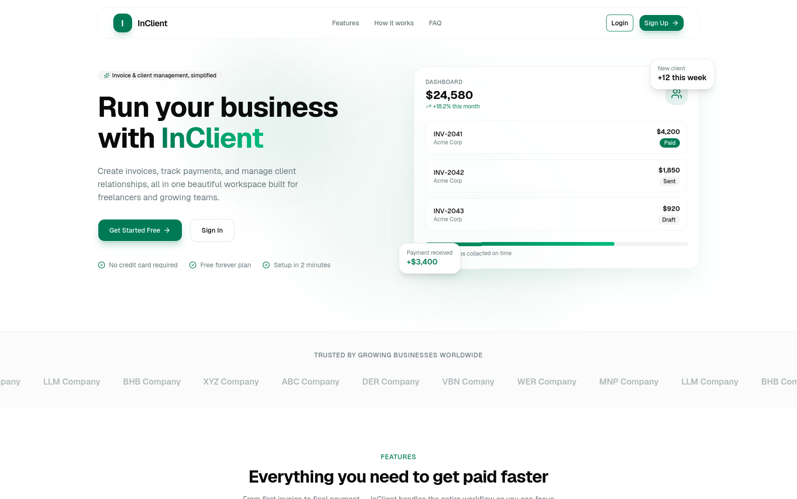
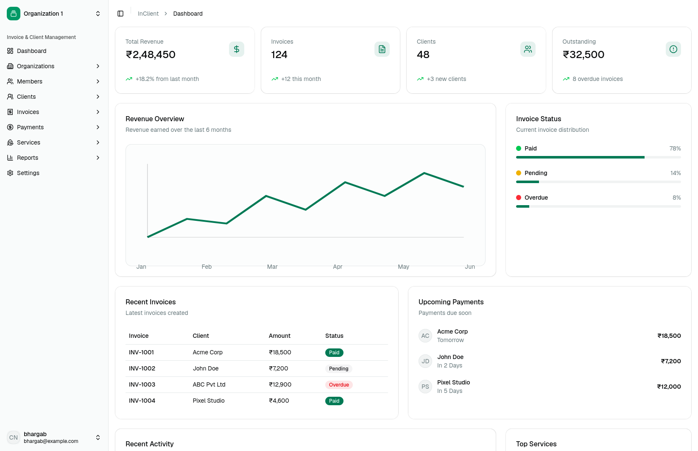
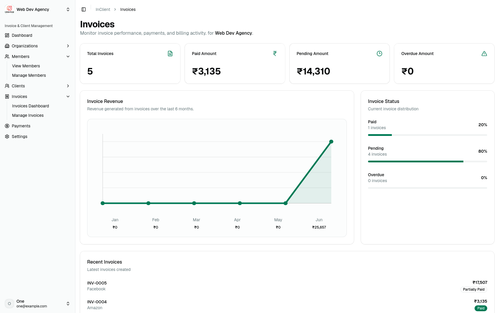
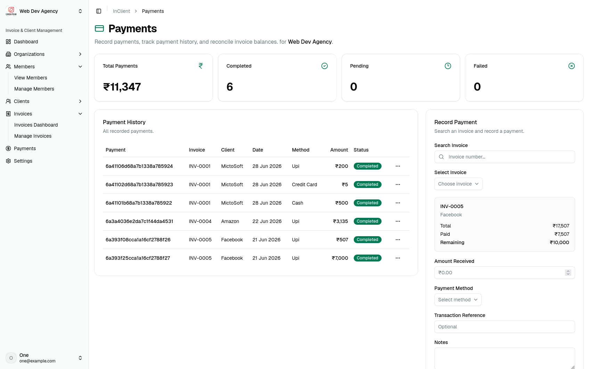

# Invoice & Client Management Platform

A full-stack invoice and client management application built for freelancers, consultants, and small agencies. The platform centralizes organizations, clients, invoices, payments, memberships, and invitation workflows in a single dashboard experience.

## Overview

### Preview

<table>
  <tr>
    <td>
      
    </td>
    <td>
      
    </td>
  </tr>
  <tr>
    <td>
      
    </td>
    <td>
      
    </td>
  </tr>
</table>

This repository contains two applications:

- `client/` - a React + Vite frontend
- `server/` - an Express + MongoDB API

The client consumes the backend through a REST API and uses authenticated, organization-aware workflows for managing day-to-day billing operations.

## Key Features

- Authentication with signup, login, logout, email verification, password reset, and session refresh
- Organization management with multi-organization support
- Client management with CRUD flows and status tracking
- Invoice creation, editing, viewing, and management
- Payment tracking and payment detail views
- Team membership and invitation flows
- Dashboard analytics for revenue, invoices, payments, and top clients
- Protected routes and role-aware navigation
- Responsive UI built with React, Redux Toolkit, React Router, Tailwind CSS, and shadcn-style components

## Tech Stack

### Frontend

- React 19
- Vite
- React Router DOM
- Redux Toolkit
- React Hook Form
- Axios
- Tailwind CSS v4
- lucide-react

### Backend

- Node.js
- Express 5
- MongoDB
- Mongoose
- JWT authentication
- bcrypt
- cookie-parser
- cors
- multer
- Cloudinary uploads
- Resend email delivery

## Repository Structure

```text
.
├── client
│   ├── src
│   ├── package.json
│   └── vite.config.js
├── server
│   ├── src
│   ├── package.json
│   └── index.js
└── README.md
```

## Prerequisites

- Node.js 18 or newer
- npm 9 or newer
- MongoDB instance
- Cloudinary account
- Resend API key

## Local Setup

### 1. Clone the repository

```bash
git clone https://github.com/bhargablinx/invoice-client-management.git
cd invoice-client-management
```

### 2. Install dependencies

Install the frontend and backend dependencies separately:

```bash
cd client
npm install

cd ../server
npm install
```

### 3. Configure environment variables

Create a `.env` file inside `server/` with the following values:

```env
PORT=5000
MONGODB_URL=mongodb://127.0.0.1:27017
CORS_ORIGIN=http://localhost:5173
CLIENT_URL=http://localhost:5173

ACCESS_TOKEN_SECRET=your_access_token_secret
ACCESS_TOKEN_EXPIRY=15m
REFRESH_TOKEN_SECRET=your_refresh_token_secret
REFRESH_TOKEN_EXPIRY=7d

CLOUDINARY_CLOUD_NAME=your_cloudinary_cloud_name
CLOUDINARY_API_KEY=your_cloudinary_api_key
CLOUDINARY_API_SECRET=your_cloudinary_api_secret

RESEND_API_KEY=your_resend_api_key
```

The frontend expects the API base URL in `client/.env`:

```env
VITE_API_BASE_URL=http://localhost:5000/api/v1
```

## Running the App

### Start the backend

```bash
cd server
npm run dev
```

The API starts on the port defined in `PORT`.

### Start the frontend

```bash
cd client
npm run dev
```

Vite serves the app locally, usually at `http://localhost:5173`.

## Available Scripts

### Client

From `client/`:

- `npm run dev` - start the Vite development server
- `npm run build` - create a production build
- `npm run preview` - preview the production build locally
- `npm run lint` - run Oxlint

### Server

From `server/`:

- `npm run dev` - start the API with Nodemon
- `npm start` - start the API in production mode

## API Summary

The backend exposes versioned REST endpoints under `/api/v1`.

### Health

- `GET /api/v1/healthcheck`

### Auth

- `POST /api/v1/auth/signup`
- `POST /api/v1/auth/login`
- `POST /api/v1/auth/logout`
- `POST /api/v1/auth/change-password`
- `POST /api/v1/auth/forgot-password`
- `POST /api/v1/auth/reset-password/:token`
- `GET /api/v1/auth/verify-email/:token`
- `POST /api/v1/auth/resend-email`
- `GET /api/v1/auth/me`
- `POST /api/v1/auth/refresh-token`
- `DELETE /api/v1/auth/delete`

### Organizations

- Organization and related client/invoice/payment routes are mounted under `/api/v1/organizations`

### Invitations

- `POST /api/v1/invitations/:token/accept`
- `POST /api/v1/invitations/:token/reject`

### Dashboard

- Dashboard analytics endpoints are mounted under `/api/v1/dashboard`

## Frontend Routes

The React app includes public and protected routes for:

- Home
- Login
- Signup
- Dashboard
- Organizations
- Members
- Clients
- Invoices
- Payments
- Invitation response flows

## Deployment Notes

- Set `CLIENT_URL` to the deployed frontend URL
- Set `CORS_ORIGIN` to the deployed frontend origin
- Use production MongoDB, Cloudinary, and Resend credentials
- Ensure cookies and JWT secrets are configured before releasing

## Project Status

The core product is functional and structured for production use, with a few workflows still evolving around advanced actions, analytics depth, and polish. The current implementation already supports the main client, invoice, payment, organization, and invitation flows.

## License

ISC
